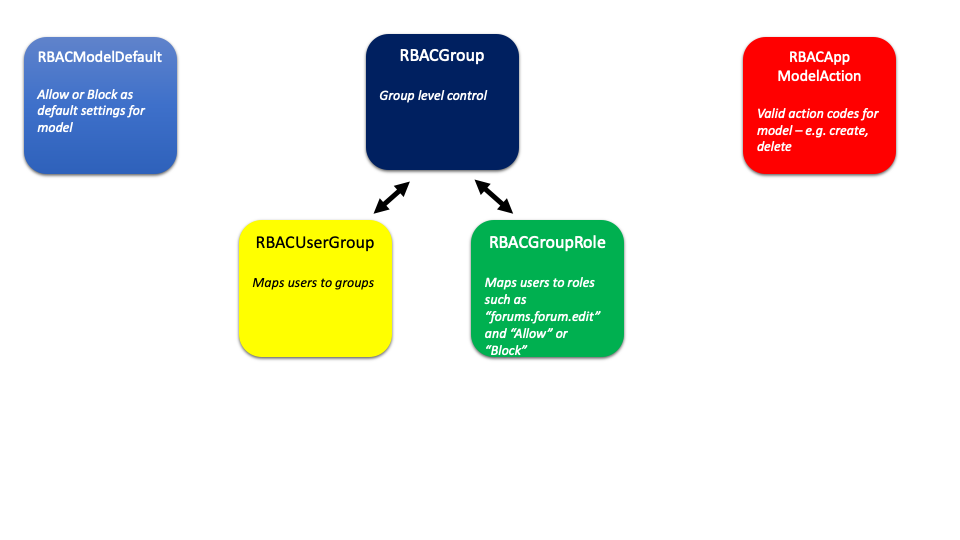

.. _notifications-overview:

.. image:: images/cobalt.jpg
 :width: 300
 :alt: Cobalt Chemical Symbol

RBAC Overview
=============

Role Based Access Control (**RBAC**) is a standard approach to security within
applications that have multiple users with different roles. This allows us to
control a user being an administrator at Club A, a director at Club B, and
a simple member of Club C. It allows us to define moderators for Forums at the
individual forum level rather than having a binary control of being a moderator
or not being a moderator that applies for all forums.

One of the key features of RBAC is the use of **Groups** to define the level of
access and to prevent users being given direct security access.
This makes it easy to give
a new user *Fred* access to the same stuff as *Bob* for his job at Club A,
without accidentally also giving him Bob's special access at Club B that he
shouldn't have.

One further feature of RBAC within Cobalt is the ability to grant admin
functions at different levels. Cobalt will become an unworkable mess if central
"uber-administrators" have to do all of the admin. This will either create a
situation where everyone has to wait for the administrator before they can do
anything (and likely argue with them about why they are doing it), or everyone
who does any admin will be an "uber-administrator". Or maybe even both.

This is one of the key principles of Cobalt - **Devolved Administration**. An
administrator for a club or congress should be able to appoint other
administrators, or directors or any other role, themselves without needing the
permission of anyone else. RBAC is the mechanism for achieving this.

Security Basics
===============

There are two main things when it comes to user security:

  - **Authentication** - Is it you? Userids, passwords, two factor authentication
    etc. Things that let us check it is really you.
  - **Authorisation** - Ok, it is you, but what are you allowed to do?

The RBAC module is about **Authorisation**. It has nothing to do with checking
who you are, just what you can do.

Background
==========

Django Options
--------------

*Django already provides this, so why are we not using that here?*

Django only provides authorisation at the model level.

Basically, with Django, we can control if someone should be able to create
a forum post,
delete a forum post, etc but not which forums they can do this in. We need
our security to be at the next level down, which Django doesn't support.

Third Party Options
-------------------

Short answer, we couldn't find one that works, is supported and isn't massively
more complicated to learn than writing our own. The code here is not difficult so
if a better third part option appears then we should use it.

RBAC Model Overview
===================

RBAC Roles
==========

When you interact with RBAC you either create, delete or check upon the roles that a
user has. Roles are hierarchical, and have a role_type of either "Allow" or
"Block". Roles consist of 3 mandatory components and one optional:

**Format:**

.. code-block:: python

  <app>.<model>.<optional model_id>.<action>

- *app*: is the Cobalt application name
- *model*: is the model within the application
- *model_id*: is the instance of the model (optional, if not supplied then this applies to all instances)
- *action*: what this rules allows you to do, application specific

For example:

1. "forums.forum.moderate" "Allow"
2. "forums.post.5.edit" "Block"
3. "organisations.organisation.7.admin" "Allow"

Example 1 says that this user is allowed to moderate all forums (RBAC doesn't know
what moderating is, it just handles the rules, it is up to each application
to implement the required controls itself). We can break this down as follows:

- *forums* - the Django application in question
- *forum* - the model within the application that this applies to
- *moderate* - the action

Note that an application can choose to use this structure for anything, it doesn't
have to refer to a model, or even an application.

Example 2 is more specific. It says that this user cannot edit the post with a
primary key of 5. This relies on the fact that Django primary keys are unique and
never reused.

**Specific rules take precedent over general rules**

If there are two rules in place as follows:

.. code-block:: python

  payments.stripetransaction.view "Allow"
  payments.stripetransaction.27.view "Block"

Then a request for *payments.stripetransaction.27.view* will return Block.

Default Behaviour
-----------------

Each application and model must define its own default behaviour in the model
:class:`rbac.models.RBACModelDefault`. The options are *Allow* or *Block*.

e.g.

.. code-block:: python

  from rbac import RBACModelDefault

  r=RBACModelDefault(app="forums", model="forum", default_behaviour="Allow")
  r.save()

Default behaviour is important because some applications are by default going
to want to prevent access (e.g. being a director for a club), and some are
by default going to want to allow access (e.g. forums).

Actions
-------

The action attribute of RBAC roles is application specific and the valid options
need to be defined in :class:`rbac.models.RBACAppModelAction`. This is the
responsibility of the application.

e.g.

.. code-block:: python

  from rbac.models import RBACAppModelAction

  r = RBACAppModelAction(app="forums", model="forum", valid_action="create")
  r.save()

For consistency across applications, all *valid_actions* should be lowercase
and unless there is good reason, the basic CRUD types should be named:

- create
- edit
- view
- delete

The All Action
--------------

In addition to what is defined by the application, RBAC adds on **all**.
You do not need to add all, it is done automatically. Any request for an action
will automatically match if the group has **all** defined.

Groups
======

Roles are never granted to users, they are only granted to Groups and users
can be members of Groups. This is the most fundamental principle of Role
Based Access Control.

Everyone
--------

Sometimes you want to flip the default behaviour within an app.model. For
example, if the default behaviour is *block* you may wish to *allow* access
but to put in specific restrictions. There are many other situation where
you need to have a global ability to change things. For this reason RBAC
has the concept of **everyone**.

Probably the easiest way to explain this is to consider the case where we do
not have **everyone**. Imagine that you wish to block people from accessing
forum id=15, with description "World Domination", given than the default
behaviour for forums.forum is "Allow". You can easily add a rule that says:

.. code-block:: python

  forums.forum.15.view block

And associate this with group

.. code-block:: python

  "Hide secret group away"

Then you can add every member of the site to this group, except for the people
that you want to be able to see it. However, every time
a new user is created you would need to add them to the same group. It won't work.

A better option is to create a rule that blocks this for everyone, and then
to add specific exceptions.

This can be done by using the user **everyone**. This is set to a specific user
defined in :file:`cobalt/settings.py` called RBAC_EVERYONE. By default this is the
first user created, id=1, which is usually an admin account that should be
disabled anyway.

So in this example, the rules to create would be:

.. code-block:: python

  # Block all

  RBACGroup: "Hide secret group away"
  RBACGroupRole: forums.forum.15.view Block
  RBACUserGroup: everyone

  # Allow specific

  RBACGroup: "Let special people in"
  RBACGroupRole: forums.forum.15.view Allow
  RBACUserGroup: Fred, Wilma, Bam-Bam

Admin
=====

Ironically, administration for RBAC is quite a tough problem to solve. While
we want to devolve administration as much as possible, we also have to ensure
that administrators can only do things they are supposed to do.

Lets start with a simple example.

.. code-block:: python

  RBACGroup: "Springfield Bridge Club Directors"
  RBACUserGroup: Bob
  RBACUserGroup: Jane
  RBACUserGroup: Alice
  RBACGroupRole: forums.forum.37.all

This defines a group of directors for a club. There are 3 users, Bob, Jane and
Alice, and there is one role: *forums.forum.37.all*.

Now lets add two administrators:

**Note that admin has a matching set of models with the word Admin added.**

.. code-block:: python

  RBACAdminGroup: "Springfield Bridge Club Admins"
  RBACAdminUserGroup: Bob
  RBACAdminGroupRole: forums.forum.37

  RBACAdminGroup: "Global Forum Admins"
  RBACAdminUserGroup: Fred
  RBACAdminGroupRole: forums.forum

So here Bob, as well as being a member of the group "Springfield Bridge Club
Directors", is also an administrator. Fred has access at a higher level and is
an administrator for all forums.

Both Bob and Fred can add or remove users from the group "Springfield Bridge
Club Directors". However, using these rules, Fred could also add the role
*forums.forum.6.view* to this group, while Bob could not.

Lets keep this in place and add one further admin group into the mix:

.. code-block:: python

  RBACAdminGroup: "Springfield Bridge Club Admins - More Access"
  RBACAdminUserGroup: Bob
  RBACAdminGroupRole: organisations.organisation.142

This rule gives Bob admin rights over organisation 142.

Now Bob can also update our original group "Springfield Bridge Club Directors"
to add the role *organisations.organisation.143.view*, however, based upon the
rules we have shown here, Fred could not. Equally, if Bob does add this role,
then Fred could not remove it.

So, in summary:

- Administrator access applies at the role level, not directly to groups.
- If an administrator has rights to a group through any admin role,
  then they can change the membership of that group (add or remove users).
- An administrator can only change the roles within a group that they have
  explicit rights to. They cannot change any other roles.

One additional point to make is that it is possible for
someone to be an administrator of a group without being a member.

Administration of Administrators
--------------------------------

Any admin can create or delete administrators within their sphere of
administration. So if they want to then Bob can give Fred access to
"Springfield Bridge Club Admins - More Access" and Fred can give Bob access to
"Global Forum Admins".

We will need some sort of a review of access but nobody can ever give another
user more access than they already have. The roles such as *forums.forum* are
the ones that need education so that admins at this level give admin rights to
specific forums for other users and not global admin rights.

API Functions
=============

Granting access is generally done by administrators of various levels through
the user interface, so checking access is the most common function. However,
access can be granted through the API.

Checking User Access
--------------------

There are several ways to check access. The choice depends mainly upon
whether you are building a list or checking at the instance level, also
whether your default settings are *Allow* or *Block*.

To check access at the instance level you can use the following example:

.. code-block:: python

  from rbac.core import rbac_user_has_role

  forum = 6
  if user_has_role(user, f"forums.forum.{{forum}}.create"):
    # allow user to continue
  else:
    # show user an error screen

For a default of *Allow* you can use the following code snippet:

.. code-block:: python

  from rbac.core import rbac_user_blocked_for_model

  blocked = rbac_user_blocked_for_model(user=request.user,
                                        app='forums',
                                        model='forum',
                                        action='view')

  # Now use the list like this
  posts_list = Post.objects.exclude(forum__in=blocked)

For a default of *Block* you can use the following code snippet:

.. code-block:: python

  from rbac.core import rbac_user_allowed_for_model

  allowed = rbac_user_allowed_for_model(user=request.user,
                                        app='forums',
                                        model='forum',
                                        action='edit')

  # Now use the list like this
  posts_list = Post.objects.filter(forum__in=allowed)

Creating A Group
----------------

To create a group through the API:

.. code-block:: python

  from rbac.core import rbac_create_group

  id = rbac_create_group("New Group for Something")

Deleting A Group
----------------

To delete a group through the API:

.. code-block:: python

  from rbac.core import rbac_delete_group

  rbac_delete_group(id)

This will also delete all users from the group by removing the entries from
RBACUserGroup (Django does this for us as a CASCADE).

Adding a Member to a Group
--------------------------

To add a member to a group through the API:

.. code-block:: python

  from rbac.core import rbac_add_user_to_group

  rbac_add_user_to_group(member, group)

Removing a Member from a Group
------------------------------

To remove a member from a group through the API:

.. code-block:: python

  from rbac.core import rbac_remove_user_from_group

  rbac_remove_user_from_group(member, group)

Adding a Role to a Group
------------------------

To add a role to a group through the API:

.. code-block:: python

  from rbac.core import rbac_add_role_to_group

  rbac_add_role_to_group(group, role)

Removing a Role from a Group
----------------------------

To remove a role from a group through the API:

.. code-block:: python

  from rbac.core import rbac_remove_role_from_group

  rbac_remove_role_from_group(group, role)
